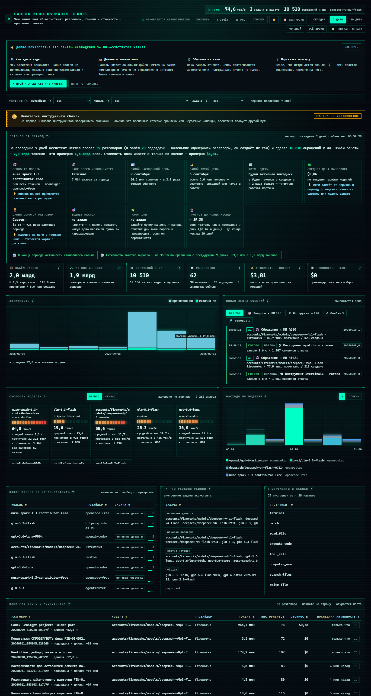
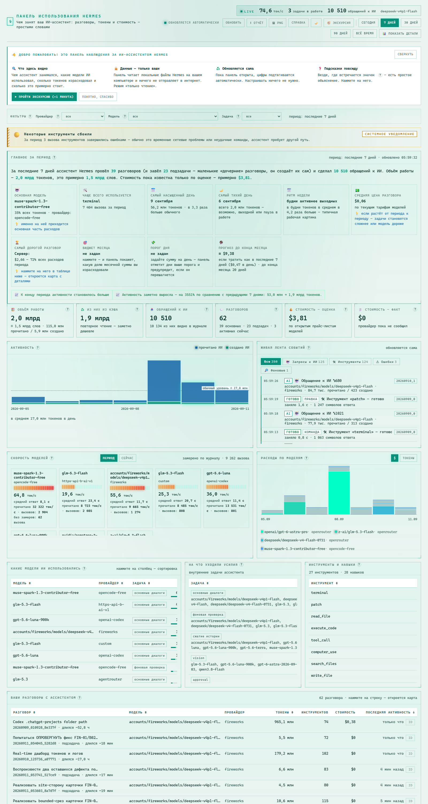

# Hermes Usage Dashboard

<p align="center">
  <strong>Локальная панель наблюдения за вашим ИИ-ассистентом Hermes.</strong><br>
  Разговоры, модели, токены, стоимость и активность — понятно, на русском и без отправки данных в интернет.
</p>

<p align="center">
  
  
</p>

`Hermes Usage Dashboard` читает только локальные файлы [Hermes Agent](https://github.com/NousResearch/hermes-agent): `state.db` и всю ротацию журнала (`logs/agent.log`, `agent.log.1`, `agent.log.2`, …). Ничего не меняет в Hermes и никуда не передаёт историю использования.

### Зачем он нужен

- увидеть, чем занят ассистент и какие модели он использует;
- контролировать расход: факт, оценку, месячный бюджет, дневной лимит и прогноз;
- быстро находить всплески активности, ошибки инструментов и конкретные разговоры;
- не разбираться в технических терминах: у метрик есть подсказки, а главные цифры пересказаны обычным языком.

> Скриншоты сделаны на реальных локальных данных Hermes. В интерфейсе доступны светлая и тёмная темы.

## Возможности

- периоды анализа: **сегодня / 7 / 30 / 90 дней / всё время**; при длинной истории график автоматически группируется по неделям — случайные всплески дней сглаживаются;
- **режим «Просто / Подробно»**: по умолчанию только главное (история, цифры, график, лента, разговоры); таблицы и технические детали раскрываются кнопкой «📊 Показать детали» и запоминаются;
- **пороги расходов**: пользователь задаёт месячный бюджет и **лимит на день** (хранятся только в его браузере) — панель показывает прогресс-бар расхода, **прогноз до конца месяца** («если тратить как последние 7 дней»), отмечает на графике расходов линию лимита и поднимает **системное уведомление**, когда сегодняшний день перешагнул лимит (а если сегодня ещё дёшево, но в периоде нашёлся день дороже лимита — предупреждает и об этом);
- **одометр на главных цифрах**: при обновлении данные не подменяются рывком — число прокручивается к новому значению; если кадры анимации не идут (панель в фоне), число всё равно доезжает до правильного;
- **drill-down без перезагрузки**: клик по строке инструмента фильтрует живую ленту по нему (сверху появляется чип «только «terminal» ✕» для сброса), клик по строке модели ставит фильтр модели — то есть от общей картины можно спуститься до конкретного инструмента или модели;
- **копирование ID разговора**: кнопка «ID» в каждой строке списка разговоров и действия «Копировать ID» / «Ссылка» / «Открыть» в подробностях выбранного узла карты;
- **экспорт кадра в PNG**: кнопка «🖼 PNG» рядом с отчётом снимает всю панель целиком (вместе с картой разговора) в картинку 2× — кадр обрезается по фактически нарисованному содержимому, поэтому пустого хвоста внизу нет;
- оформление «**неоновый пульт**»: почти чёрный фон со скан-линиями, моноширинные табличные цифры, неоновый акцент, скруглений нет — корпуса панелей с уголками-кронштейнами;
- **LED-шкалы скорости моделей**: вместо дуг — сегментная линейка, где каждый зажжённый сегмент окрашен по «жаре» (жёлтый → оранжевый → красный); у потолка (~97 %) вся линейка пульсирует и светится;
- **живая шапка `LIVE`**: текущая скорость модели (ток/с), сколько задач в работе и сколько всего обращений к ИИ — цифры крупные, подписи рядом, у каждой своя подсказка с источником замера (скорость берётся только из свежих вызовов окна 3 минуты, иначе честное «—»);
- **система статусов ленты**: `AI` / `TOOL` / `ГОТОВО` / `ВНИМАНИЕ` / `ОШИБКА` / `ФОН` — бирка словом плюс цветной край строки, поэтому лента читается без чтения текста; фильтр «⚠ Ошибки» рядом с остальными;
- **три уровня текста** — число (крупно, моноширинно) → объяснение (12,5 px, свой цвет) → служебная подпись (капс, 11 px): мельче 11 px в интерфейсе нет ничего;
- тёмная и светлая тема (кнопка ☀️/🌙, запоминается); тему и открытый разговор можно задать ссылкой: `?theme=light`, `?session=<id>`;
- **статус-баннер «светофор»** вверху: «Всё в порядке 🟢», предупреждения при ошибках инструментов или необычном всплеске активности;
- блок **«Главное за период»** — история использования простыми словами: сколько разговоров, обращений к ИИ и денег, какая модель основная, какой инструмент любимый, самый насыщенный и самый тихий день, самый дорогой разговор, ритм недели (будни vs выходные), дуга периода (активность нарастала или стихала к концу) и градуированное сравнение с предыдущим периодом («немного выросла» / «заметно выросла», 📈/📉);
- **подсказки «?»** рядом с каждой цифрой и таблицей — что такое токен, кэш, провайдер и т.д.;
- **экскурсия по панели** (кнопка «🧭 Экскурсия») — пошаговый тур по всем блокам;
- **словарик терминов** в конце страницы и приветственная справка для первого визита;
- объём работы в токенах с человеческими пояснениями («≈ столько-то слов») — сам термин спрятан в подсказку «?»;
- график активности с пунктирной линией **«обычный уровень»** — сразу видно всплески; подсказка «как читать график: смотрите на общий наклон»;
- количество API-вызовов и оценка стоимости (оценка и факт — раздельно, без выдумывания);
- разбивка по `model × provider × task` с долевыми полосками и сортировкой;
- **экспорт отчёта в CSV** (кнопка «⬇ Отчёт») — сводка, дни, модели, задачи, инструменты и разговоры; открывается в Excel;
- **живая лента событий** с фильтрами «Запросы к ИИ / Инструменты / Ошибки / Фоновые»; у каждого события две бирки — статус (AI / ГОТОВО / ОШИБКА / ФОН) и семейство инструмента (ПРАВКА / ФАЙЛ / ЗРЕНИЕ / КОМАНДА / КОД / БРАУЗЕР), поэтому лента читается без чтения текста;
- **живой HUD в шапке**: состояние LIVE, текущая скорость (ток/с), сколько задач в работе и сколько обращений к ИИ за период, плюс имя активной модели;
- **карточки, строки таблиц и события подсвечиваются при наведении** в фирменном неоне, выбранный разговор помечен бирюзовой полосой;
- **предупреждение о сбоях оформлено как системное уведомление**: янтарная заливка, штриховая кромка слева и бирка «СИСТЕМНОЕ УВЕДОМЛЕНИЕ» справа — блок не путается с обычными панелями;
- **фильтры «провайдер / модель / задача» сужают всю страницу**, а не только таблицы: главные цифры, график активности, расходы, тахометры, список разговоров и подписи в блоке «Главное» считаются по тому же срезу (один и тот же набор строк `state.db`), а на блоках, которые сузить нельзя (инструменты и навыки — в них нет признака модели), висит честная метка «весь период»;
- список разговоров со стоимостью, длительностью и относительным временем («сегодня, 14:05», «вчера», «40 мин назад»); клик по строке открывает **карту разговора** (что вы просили → что делал ассистент) с цветовой легендой и подробностями по клику на узел;
- обнаружение новых tools и skills из сообщений Hermes (навыки показываются отдельным списком);
- скелетоны при загрузке и дружелюбные пустые состояния;
- обновление интерфейса при изменении базы или логов;
- **глубокие ссылки**: `?theme=light|dark` открывает панель в нужной теме, `?session=<id>` сразу разворачивает карту разговора (клик по разговору обновляет адрес — ссылкой можно поделиться).

## Быстрый запуск

Требуется **Python 3.11+**. Внешние зависимости не нужны — используется только стандартная библиотека Python.

### Windows

```text
start-dashboard.bat
```

Для встроенной вкладки Hermes desktop используется `start-dashboard-hidden.vbs`: он запускает тот же сервер без отдельного окна консоли. Скрипт сам определяет папку проекта, поэтому работает и после переноса репозитория.

### Любая платформа

```bash
python server.py --port 8765
```

После запуска откройте [http://127.0.0.1:8765/](http://127.0.0.1:8765/).

### Посмотреть без установленного Hermes (демо-режим)

```bash
python demo/make_demo_data.py          # создаст demo/home/state.db + logs/agent.log
python server.py --hermes-home demo/home --no-open
```

Панель откроется с реалистичными данными за 90 дней: разговоры, модели, провайдеры, подзадачи, навыки, стоимость и живая лента. Сгенерированные файлы в git не попадают.

## Параметры запуска

```bash
python server.py --help
python server.py --hermes-home C:/path/to/.hermes --poll-ms 2000 --no-open
```

| Параметр | Назначение |
| --- | --- |
| `--port` | Порт локального сервера |
| `--host` | Адрес привязки (по умолчанию 127.0.0.1) |
| `--hermes-home` | Каталог Hermes с `state.db` и `logs/` |
| `--poll-ms` | Интервал проверки изменений файлов |
| `--no-open` | Не открывать браузер автоматически |

## Безопасность и режим read-only

- открывает SQLite с `mode=ro` и включает `PRAGMA query_only=ON`;
- не изменяет `state.db`, WAL-файлы или логи Hermes;
- не читает API-ключи, `.env` и конфигурационные секреты;
- не создаёт дополнительные логи;
- не требует сетевого API и сторонних сервисов.

Frontend сначала проверяет только `mtime/size` базы и логов. Полный запрос выполняется лишь после обнаружения изменения.

## Важное ограничение атрибуции

Hermes хранит точные токены отдельных основных API-вызовов в `agent.log`, а агрегаты — в `state.db` по `(session, model, provider, task)`.

Поэтому:

- карта и live feed показывают per-call tokens;
- стоимость и totals по task/model берутся из агрегатов;
- стоимость отдельного API-запроса намеренно не вычисляется искусственно.

Для полной per-request cost attribution нужен отдельный append-only usage event в Hermes.

## Покрытие журнала

Журнал Hermes ротируется по 5 МБ, поэтому дашборд читает **все** файлы `agent.log*`, а не только свежий: замеры скорости моделей, точные per-call токены и live-лента строятся по всей доступной ротации (проверка на живой системе: ~18 000 событий против 2 000 при чтении одного файла). Список файлов перечитывается на каждом heartbeat — если Hermes провернул логи во время работы панели, новый файл подхватывается без перезапуска.

## Обновление и порядок ответов

Панель обновляется сама: раз в 2 секунды опрашивает «подпись» источников и перезапрашивает снапшот, когда что-то изменилось. Холодный пересчёт на свежих логах (18–20 тысяч событий) занимает **несколько секунд** против 0,002 с на кэше, поэтому ответы приходят не по порядку.

Отсюда два правила в `static/app.js`:

- **не плодить наложение** — пока снапшот или карта в полёте, новый такой же запрос не стартует (`snapshotInFlight` / `graphInFlight`); кнопка «Обновить» и смена фильтра передают `force`;
- **не откатываться назад** — ответ применяется, только если он не старше уже показанного (`seq < snapshotApplied` → отбросить). Жёсткое «последний запрос побеждает» здесь не годится: при пересчёте в секунды и опросе раз в 2 секунды панель вообще перестала бы обновляться.

## Структура проекта

```text
hermes-usage-dashboard/
├── hermes_usage.py          # чтение SQLite, парсинг логов и подготовка snapshot
├── server.py                # локальный HTTP-сервер и API дашборда
├── static/
│   ├── index.html           # разметка панели (приветствие, блоки, словарик)
│   ├── style.css            # тема оформления и подсказки
│   └── app.js               # рендер данных, подсказки «?», экскурсия, живая лента
├── demo/
│   └── make_demo_data.py    # генератор демо-данных (state.db + agent.log)
├── tests/                   # автоматические тесты
├── tools/
│   └── live_check.py        # живая проверка панели в headless-Chrome (CDP)
├── start-dashboard.bat      # запуск на Windows с консолью
├── start-dashboard-hidden.vbs # запуск из Hermes desktop без консоли
└── README.md
```

## Тесты

Юнит-тесты — только чтение:

    python -m unittest discover -s tests

**Живая проверка** (нужен запущенный сервер и Chrome): гоняет headless-браузер по настоящей панели и печатает факты, а не намерения — прокрутку одометра, переход баннера в режим порога, фильтрацию ленты по инструменту, фильтр модели, копирование ID и непустой PNG:

    python tools/live_check.py --png out.png

Скрипт завершается кодом 1, если что-то не сработало.

Подробный вывод юнит-тестов:

```bash
python -m unittest discover -s tests -v
```
